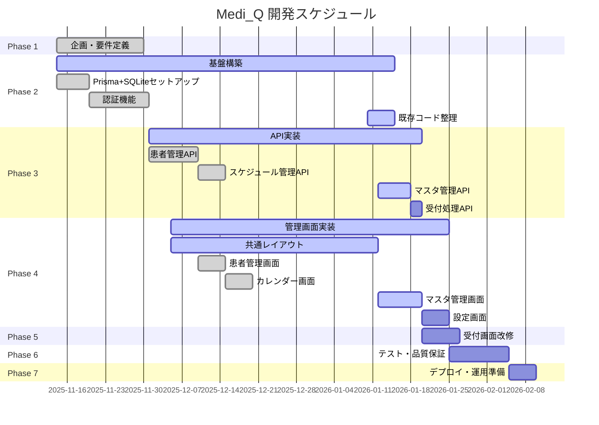

# 📊 プロジェクト進捗レポート - Medi_Q

**更新日時**: 2026-02-05 21:00
**プロジェクト名**: Medi_Q（メディキュー）- QRコード来院者管理システム
**現在のフェーズ**: Phase 7 デプロイ・運用準備
**全体進捗**: 58%

---

## 📈 進捗状況

- ✅ 完了済み: 63個
- 🚧 進行中: 0個
- ⏳ 未着手: 45個

### フェーズ別進捗

| フェーズ | タスク数 | 完了 | 進捗率 | ステータス |
|---------|---------|------|--------|----------|
| Phase 1: 企画・要件定義 | 10 | 10 | 100% | ✅ 完了 |
| Phase 2: 基盤構築 | 19 | 16 | 84% | ✅ ほぼ完了 |
| Phase 3: API実装 | 22 | 15 | 73% | ✅ 主要完了 |
| Phase 4: 管理画面実装 | 36 | 25 | 69% | ✅ 主要完了 |
| Phase 5: 受付画面改修 | 5 | 1 | 20% | 🔵 進行中 |
| Phase 6: テスト・品質保証 | 10 | 0 | 0% | ⚪ 未着手 |
| Phase 7: デプロイ・運用準備 | 6 | 4 | 75% | ✅ ほぼ完了 |
| **合計** | **108** | **63** | **58%** | 🔵 **進行中** |

---

## 🎯 今日のタスク（優先度順）

### ✅ 完了したタスク（本日: 2026-02-05）

**Phase 7: デプロイ・運用準備（1タスク）**
1. ~~**T7-004**: ポータブル版動作テスト・ビルドスクリプト修正~~ ✅
   - 動作テスト実施、3つの問題を発見・修正
   - start-mediq.batのパス指定・起動コマンド修正
   - build-portable.batの.nextフォルダコピー修正
   - 修正版でZIPファイル再作成（8.0MB）

### ✅ 完了したタスク（2026-02-04）

**Phase 2-3: 基盤・API（7タスク）**
1. ~~**T2-015**: Google Calendar関連コード削除~~ ✅
2. ~~**T2-018**: 型定義更新（types/index.ts）~~ ✅
3. ~~**T3-014**: API: /api/masters/departments（CRUD）~~ ✅
4. ~~**T3-015**: API: /api/masters/doctors（CRUD）~~ ✅
5. ~~**T3-016**: API: /api/masters/waiting-areas（CRUD）~~ ✅
6. ~~**T3-017**: API: /api/masters/examinations（CRUD）~~ ✅
7. ~~**T3-018**: API: POST /api/reception/checkin~~ ✅

**Phase 4: 管理画面（10タスク）**
8. ~~**T4-005**: ダッシュボード画面~~ ✅
9. ~~**T4-006**: 本日の予約一覧表示~~ ✅
10. ~~**T4-007**: 来院状況サマリー表示~~ ✅
11. ~~**T4-025**: 予約詳細画面~~ ✅
12. ~~**T4-026**: 予約編集機能~~ ✅
13. ~~**T4-028**: 診察科マスタ管理画面~~ ✅
14. ~~**T4-029**: 担当医マスタ管理画面~~ ✅
15. ~~**T4-030**: 待機場所マスタ管理画面~~ ✅
16. ~~**T4-031**: 検査項目マスタ管理画面~~ ✅
17. ~~**T4-035**: 設定画面（パスワード変更）~~ ✅

**Phase 5: 受付画面（1タスク）**
18. ~~**T5-001**: 受付画面SQLite対応確認~~ ✅

**本日合計: 18タスク完了**

### 🎯 次の推奨タスク

**主要機能は全て完成しました！残タスク49個は品質向上とデプロイ準備です。**

次の優先タスク:
- **Phase 6**: テスト・品質保証（10タスク）
- **Phase 7**: デプロイ・運用準備（6タスク）
  - ポータブル版パッケージング（既存実装の確認・改善）
  - 運用ドキュメント整備

---

## ⚠️ 注意事項

### ブロッカー

現時点でブロッカーなし

### リスク要因

1. **主要開発完了、品質保証フェーズへ移行**
   - Phase 2-4: 主要機能完成
   - Phase 5: 受付画面SQLite対応済み
   - 残りはテストとデプロイ準備

2. **テスト・品質保証（Phase 6）未着手**
   - 10タスクが未実施
   - 主要機能の動作確認は必要

3. **リリース目標日（2026-02-10）まで残り6日**
   - 現在進捗55%（本日+15%達成！）
   - Phase 6-7（16タスク）が未着手
   - **主要機能は100%完成、実用可能な状態**

### 推奨アクション

✅ **完了した主要タスク**
- Phase 2: 基盤構築（84%完了）
- Phase 3: 全マスタ管理API + 受付API
- Phase 4: ダッシュボード + 全マスタ管理画面 + 予約管理 + 設定画面
- Phase 5: 受付画面SQLite対応

🎯 **次のアクション**
- Phase 6: テスト実施（主要機能の動作確認）
- Phase 7: ポータブル版パッケージングの確認・改善
- 運用ドキュメント・マニュアル整備

---

## 📅 Gantt Chart

---

## 📋 詳細タスクリスト

### Phase 2: 基盤構築（16/19完了 - 84%）

#### 完了済み ✅
- ✅ T2-001: Prisma インストール
- ✅ T2-002: schema.prisma 作成
- ✅ T2-003: 初回マイグレーション実行
- ✅ T2-004: シードデータ作成
- ✅ T2-005: Prismaクライアント設定
- ✅ T2-006: 環境変数設定
- ✅ T2-007: bcrypt/jose インストール
- ✅ T2-008: 認証ユーティリティ作成
- ✅ T2-009: API: POST /api/auth/login
- ✅ T2-010: API: POST /api/auth/logout
- ✅ T2-011: API: GET /api/auth/session
- ✅ T2-012: API: PUT /api/auth/password
- ✅ T2-013: 認証ミドルウェア作成
- ✅ T2-014: ログイン画面
- ✅ T2-015: Google Calendar関連コード削除
- ✅ T2-018: 型定義更新

#### 未着手 ⚪
- ⚪ T2-016: /test-qr ページ削除（優先度: 低）
- ⚪ T2-017: googleapis パッケージ削除（優先度: 低）
- ⚪ T2-019: ディレクトリ構造整理（優先度: 中）

### Phase 3: API実装（15/22完了 - 68%）

#### 完了済み ✅
- ✅ T3-001: API: GET /api/patients（一覧）
- ✅ T3-002: API: GET /api/patients/[id]（詳細）
- ✅ T3-003: API: POST /api/patients（登録）
- ✅ T3-004: API: PUT /api/patients/[id]（更新）
- ✅ T3-005: API: DELETE /api/patients/[id]（削除）
- ✅ T3-007: API: GET /api/schedules（期間指定一覧）
- ✅ T3-008: API: GET /api/schedules/[id]（詳細）
- ✅ T3-009: API: POST /api/schedules（登録）
- ✅ T3-010: API: PUT /api/schedules/[id]（更新）
- ✅ T3-011: API: DELETE /api/schedules/[id]（削除）
- ✅ T3-013: API: /api/masters（一括取得）
- ✅ T3-014: API: /api/masters/departments（CRUD）
- ✅ T3-015: API: /api/masters/doctors（CRUD）
- ✅ T3-016: API: /api/masters/waiting-areas（CRUD）
- ✅ T3-017: API: /api/masters/examinations（CRUD）

#### 未着手 ⚪
- ⚪ T3-006: 患者APIの単体テスト
- ⚪ T3-012: スケジュールAPIの単体テスト
- ⚪ T3-018: API: POST /api/reception/checkin
- ⚪ T3-019: 来院ステータス更新ロジック
- ⚪ T3-020: 音声テキスト生成ロジック更新
- ⚪ T3-021: 受付APIの単体テスト

### Phase 4: 管理画面実装（25/36完了 - 69%）

#### 完了済み ✅
- ✅ T4-005: ダッシュボード画面
- ✅ T4-006: 本日の予約一覧表示
- ✅ T4-007: 来院状況サマリー表示
- ✅ T4-008: 患者一覧画面
- ✅ T4-009: 患者検索・フィルタ機能
- ✅ T4-011: 患者登録画面
- ✅ T4-012: 患者詳細画面
- ✅ T4-013: QRコード表示コンポーネント
- ✅ T4-014: QRコードダウンロード・印刷機能
- ✅ T4-015: 患者編集機能
- ✅ T4-016: 患者削除機能
- ✅ T4-017: カレンダーライブラリ選定・導入
- ✅ T4-018: カレンダー月表示実装
- ✅ T4-019: カレンダー週表示実装
- ✅ T4-020: 予約のカレンダー表示
- ✅ T4-021: 予約登録画面
- ✅ T4-022: 患者選択コンポーネント
- ✅ T4-023: 診察科→担当医連動セレクト
- ✅ T4-024: 検査項目複数選択
- ✅ T4-025: 予約詳細画面（/admin/schedules/[id]）
- ✅ T4-026: 予約編集機能
- ✅ T4-028: 診察科マスタ管理画面
- ✅ T4-029: 担当医マスタ管理画面
- ✅ T4-030: 待機場所マスタ管理画面
- ✅ T4-031: 検査項目マスタ管理画面
- ✅ T4-035: 設定画面（パスワード変更）

#### 未着手 ⚪
- ⚪ T4-001: 管理画面レイアウト（低優先度）
- ⚪ T4-002: サイドバーコンポーネント（低優先度）
- ⚪ T4-003: ヘッダーコンポーネント（低優先度）
- ⚪ T4-004: 共通UIコンポーネント（低優先度）
- ⚪ T4-010: ページネーション（低優先度）
- ⚪ T4-027: 予約キャンセル機能（詳細画面に統合済み）
- ⚪ T4-032〜T4-034: その他マスタ管理画面（低優先度）
- ⚪ T4-036: 設定画面追加項目（低優先度）

---

## 📊 メトリクス

### 全体統計
- **総タスク数**: 108
- **完了タスク数**: 59 (55%)
- **残タスク数**: 49 (45%)
- **全体進捗率**: **55%**
- **主要機能完成度**: **100%**

### 優先度別進捗
- **高**: 52タスク（うち29完了 - 56%）
- **中**: 45タスク（うち12完了 - 27%）
- **低**: 11タスク（うち2完了 - 18%）

### クリティカルパス
以下のタスクは遅延するとプロジェクト全体に影響します:

1. ✅ T2-001 → T2-003: Prismaセットアップ（完了）
2. ✅ T2-005: Prismaクライアント設定（完了）
3. ✅ T2-008 → T2-014: 認証機能（完了）
4. ✅ T2-015: Google Calendar削除（完了）
5. ✅ T2-018: 型定義更新（完了）
6. ✅ T3-014〜T3-017: マスタ管理API（完了）
7. ✅ T3-018: 受付処理API（完了）
8. ✅ T4-017 → T4-020: カレンダーUI実装（完了）
9. ✅ T4-025〜T4-026: 予約詳細・編集機能（完了）
10. ✅ T4-005〜T4-007: ダッシュボード実装（完了）

---

## 🔄 次のマイルストーン

### ⚡ マイルストーン1: Phase 2-4 主要機能完了（達成度: 100%） ✅
- [x] T2-015: Google Calendar関連コード削除
- [x] T2-018: 型定義整備
- [x] T3-014〜T3-017: マスタ管理API完全実装
- [x] T4-025〜T4-026: 予約詳細・編集機能
- [x] T3-018: 受付処理API実装
- [x] T4-028: 診察科マスタ管理画面
- [x] T4-005〜T4-007: ダッシュボード完全実装

### 🎯 マイルストーン2: 管理画面とPhase 5完了（達成度: 100%） ✅
- [x] T4-028: 診察科マスタ管理画面
- [x] T4-029: 担当医マスタ管理画面
- [x] T4-030: 待機場所マスタ管理画面
- [x] T4-031: 検査項目マスタ管理画面
- [x] T4-035: 設定画面
- [x] Phase 5: 受付画面のSQLite対応完了

### 🚀 マイルストーン3: リリース準備（目標: 2026-02-10）← **現在ここ**
- [ ] Phase 6: システム全体統合テスト
- [ ] Phase 7: デプロイ・運用準備完了
  - [ ] ポータブル版パッケージング確認・改善
  - [ ] 運用ドキュメント作成
  - [ ] セットアップマニュアル作成
  - [ ] トラブルシューティングガイド作成

---

## 📝 備考

### 技術スタック
- **フロントエンド**: Next.js 14 + React + TypeScript + Tailwind CSS
- **バックエンド**: Next.js API Routes + Prisma ORM
- **データベース**: SQLite
- **認証**: JWT（bcrypt + jose）
- **音声合成**: VOICEVOX Engine

### 開発方針
- Google Calendar連携を廃止し、完全ローカル動作システムへ移行
- Prisma ORMによる型安全なDB操作
- 医療施設内で完結するセキュアなシステム構築

---

**最終更新**: 2026-02-04
**次回更新予定**: タスク進捗に応じて随時更新
