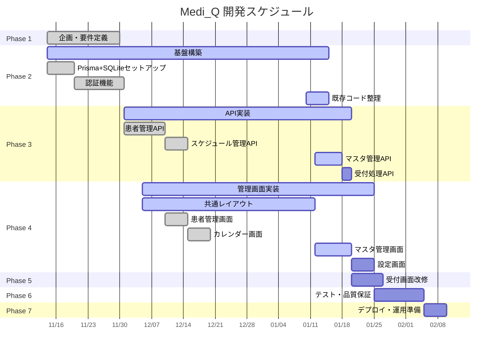

# 📊 プロジェクト進捗レポート - Medi_Q

**レポート日**: 2026-01-12
**プロジェクト名**: Medi_Q（メディキュー）- QRコード来院者管理システム
**現在のフェーズ**: Phase 2-4 並行開発中（基盤構築・API実装・管理画面実装）
**全体進捗**: 38%

---

## 📈 進捗状況

### サマリー
- ✅ **完了済み**: 41個（38%）
- 🚧 **進行中**: 66個（62%）
- ⏳ **未着手**: Phase 5-7は今後着手

### フェーズ別進捗

| フェーズ | タスク数 | 完了 | 進捗率 | ステータス |
|---------|---------|------|--------|----------|
| Phase 1: 企画・要件定義 | 10 | 10 | 100% | ✅ 完了 |
| Phase 2: 基盤構築 | 19 | 14 | 74% | 🔵 進行中 |
| Phase 3: API実装 | 22 | 11 | 50% | 🔵 進行中 |
| Phase 4: 管理画面実装 | 36 | 16 | 44% | 🔵 進行中 |
| Phase 5: 受付画面改修 | 5 | 0 | 0% | ⚪ 未着手 |
| Phase 6: テスト・品質保証 | 10 | 0 | 0% | ⚪ 未着手 |
| Phase 7: デプロイ・運用準備 | 6 | 0 | 0% | ⚪ 未着手 |
| **合計** | **108** | **41** | **38%** | 🔵 **進行中** |

---

## 🎯 今週の優先タスク

### 最優先（今週中に着手）

1. **T2-015: Google Calendar関連コード削除**（優先度: 高）
   - 目的: 旧システムのコードを完全削除し、新SQLiteベースシステムへ完全移行
   - 影響: コードベースのクリーンアップ、保守性向上
   - 担当者: 開発者

2. **T2-018: 型定義更新（types/index.ts）**（優先度: 高）
   - 目的: Prismaスキーマに対応した型定義を整備
   - 影響: 多くのタスクの前提条件、型安全性の向上
   - 担当者: 開発者

3. **T3-014〜T3-017: マスタ管理API実装**（優先度: 中）
   - 診察科マスタCRUD
   - 担当医マスタCRUD
   - 待機場所マスタCRUD
   - 検査項目マスタCRUD
   - 目的: 管理画面のマスタ管理機能を完成させる
   - 担当者: 開発者

### 次週着手予定

4. **T3-018: API: POST /api/reception/checkin**（優先度: 高）
   - 目的: 受付画面の核となる来院処理APIを実装
   - 影響: Phase 5（受付画面改修）の前提条件
   - 担当者: 開発者

5. **T4-025: 予約詳細画面実装**（優先度: 高）
   - 目的: カレンダーから予約をクリックした際の詳細表示
   - 担当者: 開発者

6. **T4-026: 予約編集機能実装**（優先度: 高）
   - 目的: 既存予約の修正機能
   - 担当者: 開発者

---

## ⚠️ 注意事項・リスク

### ブロッカー
現時点でブロッカーなし

### リスク要因

1. **Phase 2-4の並行開発による複雑性**
   - **リスク**: 複数フェーズが同時進行中のため、依存関係の管理が複雑化
   - **対策**: T2-018（型定義更新）を優先的に完了させ、他タスクへの影響を最小化

2. **未完成のマスタ管理API**
   - **リスク**: T3-014〜T3-017が未完成のため、管理画面の一部機能が動作不可
   - **対策**: 今週中にマスタ管理API群を集中実装

3. **受付画面改修の遅延可能性**
   - **リスク**: T3-018（受付API）が完了しないとPhase 5に着手できない
   - **対策**: Phase 3のAPI実装を優先的に進める

### 推奨アクション

✅ **即座に実施**:
- Phase 2の残タスク（T2-015〜T2-019）を優先完了
- 型定義の早期整備でコード品質を担保

✅ **今週中**:
- マスタ管理API（T3-014〜T3-018）を集中実装
- 既存コードのクリーンアップ

✅ **来週**:
- 受付処理API実装に着手
- 予約詳細・編集機能の実装

---

## 📊 主要マイルストーン

### マイルストーン1: Phase 2-3完了（目標: 2026-01-20）
- [ ] Google Calendar関連コード削除
- [ ] 型定義整備
- [ ] マスタ管理API完全実装
- [ ] 受付処理API実装

**進捗**: Phase 2: 74%、Phase 3: 50%
**リスク**: 低（順調に進行中）

### マイルストーン2: Phase 4完了（目標: 2026-01-25）
- [ ] 管理画面レイアウト完成
- [ ] マスタ管理画面実装
- [ ] 予約詳細・編集機能実装

**進捗**: 44%
**リスク**: 中（マスタ管理APIの完了が前提）

### マイルストーン3: Phase 5完了（目標: 2026-01-27）
- [ ] 受付画面のSQLite対応完了
- [ ] システム全体統合完了

**進捗**: 0%（未着手）
**リスク**: 中（Phase 3完了に依存）

### マイルストーン4: 本番リリース（目標: 2026-02-10）
- [ ] 全機能テスト完了
- [ ] 受入テスト合格
- [ ] デプロイ・運用開始

**進捗**: 0%（Phase 6-7未着手）
**リスク**: 低（スケジュール的に余裕あり）

---

## 📋 完了タスクハイライト

### Phase 1（完了済み ✅）
- ✅ 要件定義書作成（v1.0 → v2.0改訂）
- ✅ 設計書作成（v1.0 → v2.0改訂）
- ✅ テスト設計書作成（v1.0 → v2.0改訂）
- ✅ タスク分解作成（v1.0 → v2.0改訂）

### Phase 2（74%完了 🔵）
**完了済み**:
- ✅ Prisma + SQLiteセットアップ
- ✅ 認証機能完全実装（ログイン、セッション、パスワード変更）
- ✅ ログイン画面実装

**残タスク**:
- ⚪ Google Calendar関連コード削除
- ⚪ 型定義更新
- ⚪ ディレクトリ構造整理

### Phase 3（50%完了 🔵）
**完了済み**:
- ✅ 患者管理API完全実装（CRUD）
- ✅ スケジュール管理API完全実装（CRUD）
- ✅ マスタ一括取得API実装

**残タスク**:
- ⚪ マスタ管理API（各CRUD）
- ⚪ 受付処理API
- ⚪ 各種単体テスト

### Phase 4（44%完了 🔵）
**完了済み**:
- ✅ 患者管理画面（一覧、登録、詳細、編集、削除）
- ✅ QRコード表示・ダウンロード・印刷機能
- ✅ カレンダーUI実装（月表示・週表示）
- ✅ 予約登録画面（患者選択、診察科→担当医連動）

**残タスク**:
- ⚪ 予約詳細・編集機能
- ⚪ マスタ管理画面
- ⚪ ダッシュボード
- ⚪ 設定画面

---

## 📅 Gantt Chart

---

## 🔧 技術スタック

### 確定済み技術
- **フロントエンド**: Next.js 14 + React 18 + TypeScript 5 + Tailwind CSS 3
- **バックエンド**: Next.js API Routes + Prisma ORM 5
- **データベース**: SQLite 3.x
- **認証**: JWT（bcrypt + jose）
- **音声合成**: VOICEVOX Engine
- **QRコード**: @zxing/library（読取）、qrcode（生成）
- **カレンダーUI**: 実装済み（独自実装またはライブラリ）

### 開発ツール
- **テスト**: Vitest（単体）、Playwright（E2E）
- **コード品質**: ESLint + Prettier
- **DB管理**: Prisma Studio

---

## 📝 決定事項

### アーキテクチャ決定
1. **Google Calendar連携の廃止** ✅
   - 理由: データ管理の施設内完結、オフライン動作、カスタマイズ性
   - 状態: 設計完了、実装は削除タスク（T2-015）で対応

2. **SQLite + Prisma採用** ✅
   - 理由: サーバーレス、ファイルベースDB、型安全なORM
   - 状態: セットアップ完了、本格運用開始

3. **JWT認証方式** ✅
   - 理由: シンプル、HttpOnly Cookieで安全
   - 状態: 実装完了

### 次回決定が必要な事項
- 初期管理者パスワードの決定（Phase 7で対応）
- バックアップ運用方針の確定（Phase 7で対応）

---

## 📈 メトリクス

### 全体統計
- **総タスク数**: 108
- **完了タスク数**: 41
- **残タスク数**: 67
- **全体進捗率**: 38%
- **予定リリース日**: 2026-02-10
- **残り日数**: 約29日

### 優先度別タスク数
- **高**: 52タスク（うち27完了、52%）
- **中**: 45タスク（うち12完了、27%）
- **低**: 11タスク（うち2完了、18%）

### 速度メトリクス
- **Phase 1**: 10タスク/17日 = 0.59タスク/日
- **Phase 2-4**: 31タスク/約50日 = 0.62タスク/日
- **平均**: 41タスク/約60日 = 0.68タスク/日

**予測**:
- 残り67タスク ÷ 0.68タスク/日 ≈ 99日
- ⚠️ **注意**: 現在のペースでは目標日（29日後）に間に合わない可能性
- **対策**: Phase 5-7はPhase 1-4より小規模なため、加速が見込まれる

---

## 🎉 成果ハイライト

### 主要成果物
1. ✅ **完全なPrisma + SQLiteセットアップ**
   - スキーマ定義、マイグレーション、シードデータ完備

2. ✅ **認証システム完成**
   - ログイン、セッション管理、パスワード変更機能

3. ✅ **患者管理機能完成**
   - API（CRUD）+ 管理画面（一覧、登録、詳細、編集、削除）
   - QRコード生成・表示・ダウンロード・印刷

4. ✅ **スケジュール管理基盤完成**
   - API（CRUD）+ カレンダーUI（月表示・週表示）
   - 予約登録画面（患者選択、診察科→担当医連動、検査項目選択）

### 技術的達成
- 型安全な開発環境の確立（TypeScript + Prisma）
- 認証セキュリティの実装（JWT + bcrypt）
- 直感的なカレンダーUIの実装

---

## 📌 次回レポート予定

**次回更新日**: 2026-01-19（1週間後）
**予定内容**:
- Phase 2完了報告
- Phase 3進捗（マスタ管理API、受付処理API）
- Phase 4進捗（予約詳細・編集機能）

---

**レポート作成日**: 2026-01-12
**作成者**: 開発チーム
**承認者**: プロジェクトマネージャー
